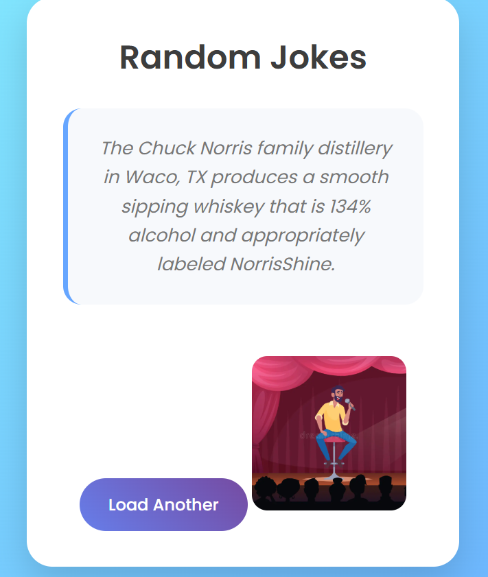

# 😂 Random Joke Generator

A simple web application built using HTML, CSS, and JavaScript that fetches and displays random jokes using a public API.

## 🚀 Features

- Generate random jokes instantly
- Fetch data from a public API
- Dynamic content updates
- Responsive user interface
- Error handling for API requests

## 🛠️ Technologies Used

- HTML5
- CSS3
- JavaScript
- Fetch API
- REST API

## 📷 Screenshot

## 📚 What I Learned

- Fetch API and asynchronous JavaScript
- Working with REST APIs and JSON data
- DOM manipulation and dynamic content rendering
- Event handling in JavaScript
- Error handling and debugging
- Responsive web design principles

## 👨‍💻 Author

Navya Varikuti

GitHub: https://github.com/navyavarikuti

LinkedIn: https://www.linkedin.com/in/navyavarikuti/
